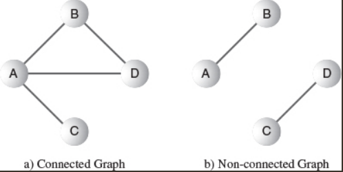

# Graph

> Graphs are one of the most versatile data structures used in computer programming

## Indexing

- Introduction to Graph
- Graph BFS
- Graph DFS
- Adjacency List
- Adjacency Matrix
- Dijkstra’s Algorithm
- Bellman-Ford's Algorithm
- Minimum-Spanning Tree

## 1. Introducing to Graph

- Graphs are data structures rather like trees. Tree is a kind of graph
- Nodes in the Graph are called **vertices** (singular is vertex)

### Adjacency

- Two vertices are said to be adjacent to one another if they are connected by a single edge

### Path

- A **path** is a sequence of edges
- Path from B to C is BAC or BDAC

### Connected Graphs

- A graph is said to be connected if there is at least one **path** from every vertex to every other vertex.

### Directed and Weighted Graph 

## Representing Graph in Java

### Vertices 