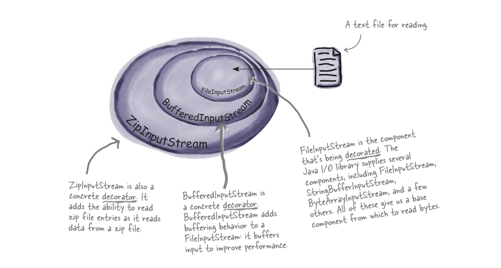

# Decorator Design Pattern

## Context / Problems :

- Imagine you are the chairperson of The Starbuzz Coffee. You want to digitalize the menu

- Your system might look like this:
  

- With every new condiment or toppings, we have to change the cost of each beverage to suit with their type.
- The result will be like this:
- 

=> **An explosion of classes**

=> Hard for maintenance, and violates the [2](../README.md#design-principle) and [4](../README.md#design-principles)
design
principles.

### How to achieve code reuse without **inheritance** ?

> Through _**composition**_ and _**delegation**_ (Chapter 1: Strategy Pattern and Chapter 2: Observer Pattern)

- When inherit behavior by subclassing, that behavior is set statically at compile time.
- All subclasses must inherit the same behavior as their superclass.
- If extend object's behavior through **composition**, that will be set dynamically at runtime.

### Open-Closed Principle

> Classes should be open for extension, but closed for modification.

- Be careful when choosing the areas of code that need to be extended

## Meet the Decorator Pattern

- Representing beverages and condiments with **inheritance** is not fit well (classes explosion).
  => Start with a beverage and **decorate** it with condiments at the runtime.
- Example: If a customer wants a Mocha with extra Milk Foam and Chocolate Cookie:
    1. Start with a `Espresso` object.
    2. Decorate it with a `Mocha` object.
    3. Decorate it with a `ChocolateCookie` object.
    4. Call the `cost()` method and rely on delegation to add up the condiment costs.

### Definition:

> The **Decorator Pattern** attaches additional responsibilities to an object dynamically. Decorators provide a flexible
> alternative to subclassing for extending functionality.

### Characteristics:

1. Decorators have the same supertype as the objects they decorate.
2. You can use one of more decorators to wrap an object
3. Given that the decorator has the same supertype as the objects it decorates, we can pass around a decorated object in
   place of the original (wrapped) object.
4. The decorator adds its own behavior before and/or after delegating to the object it decorates to do the rest of the
   job.
5. Objects can be decorated at any time, so we can decorate objects dynamically at runtime with as many decorators as we
   like.

### Class Diagram:

### Applying:

### Why using **inheritance** here (`CondimentDecorator` extends `Beverage`) ?

- Using **inheritance** to achieve the _type matching_ (Characteristics#1), but not for the _behavior_

### Implementations

- Check out demo [Starbuzz](starbuzzcoffee) and my own implementation [MythicShop](mymythicalshop)

## Real-World Examples using Decorator Pattern: Java I/O

## Drawbacks:

- Adding a load of classes to a design leads too hard to understand code.
- Increasing the complexity of the code needed to instantiate the component.

## Bullet Points (Summary):

1. Inheritance is one form of an extension, but not necessarily the best way to achieve flexibility in software designs.
2. In software designs, behavior should be allowed to be extended without the need to modify existing code.
3. Composition and delegation can often be used to add new behaviors at runtime
4. The Decorator Pattern provides an alternative to subclassing for extending behavior
5. The Decorator Pattern involves a set of decorator classes that are used to wrap concrete components
6. Decorator classes mirror the type of the components they decorate. (In fact, they are the same type as the components they decorate, either through inheritance or interface implementation.)
7. Decorators change the behavior of their components by adding new functionality before and/or after (or even in place of) method calls the component.
8. You can wrap a component with any number of decorators
9. Decorators are typically transparent to the client of the component—that is, unless the client is relying on the component’s concrete type.
10. Decorators can result in many small objects in our design, and overuse can be complex.

