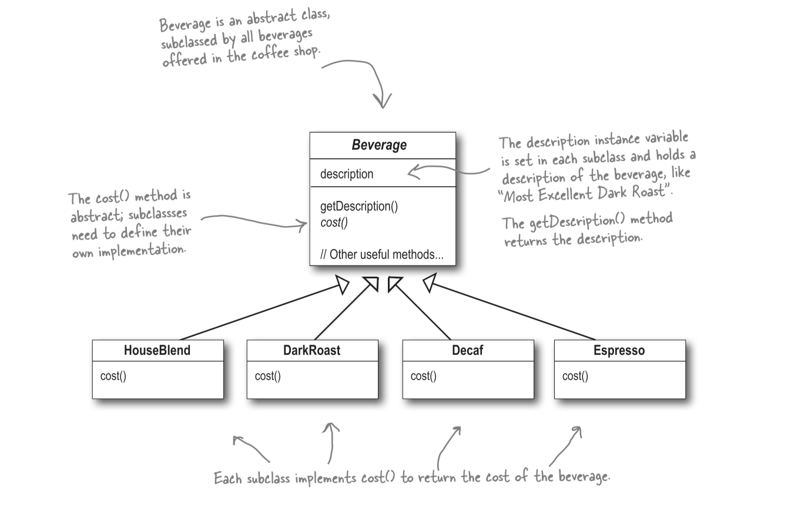
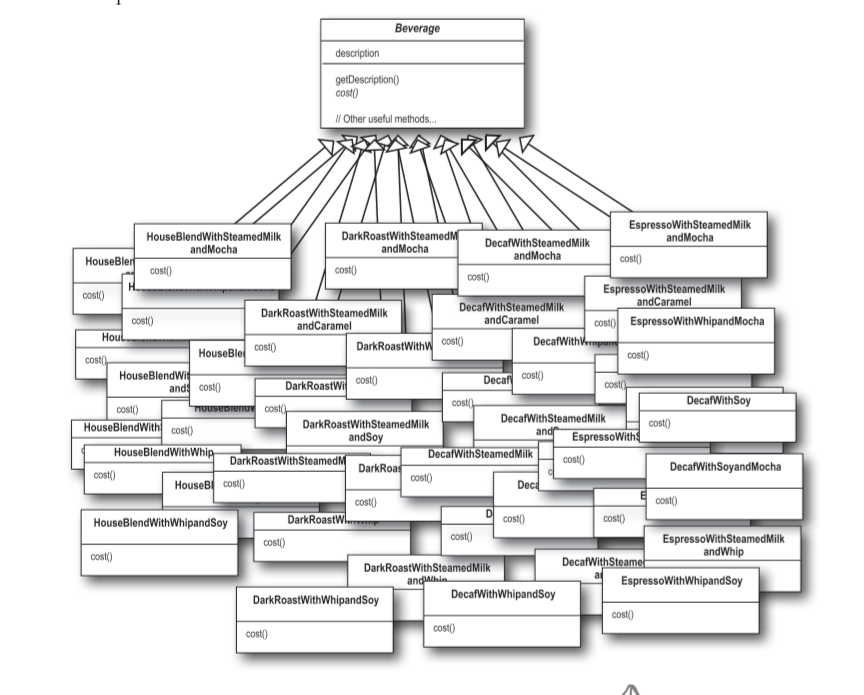

# Decorator Design Pattern

## Context / Problems :

- Imagine you are the chairperson of The CoffeeHouse. You want to digitalize the menu

- Your system might look like this:
  

- With every new condiment or toppings, we have to change the cost of each beverage to suit with their type.
- The result will be like this:
- 

> => **An explosion of classes**

=> Hard for maintenance, violates the [2](../README.md#design-principle) and [4](../README.md#design-principles) design principles.

## Open-Closed Principle
